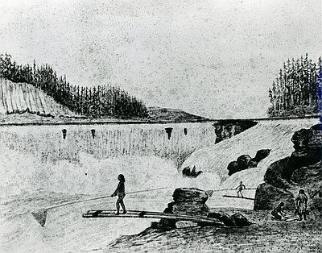
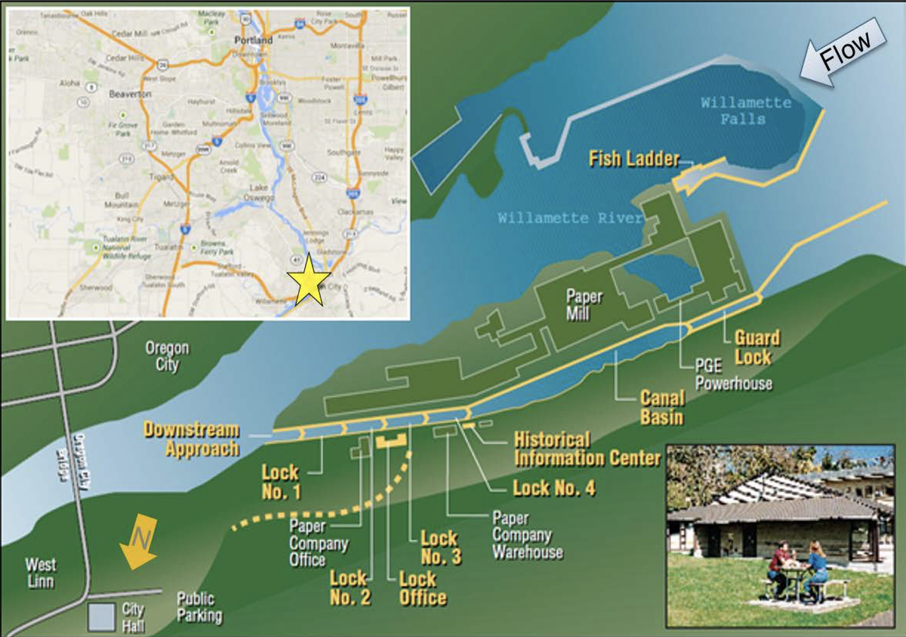

```{r setup, include=FALSE}
knitr::opts_chunk$set(echo = TRUE, warning= FALSE, message= FALSE)

library(bslib)
library(here)
library(tidyverse)
library(lubridate)
library(tsibble)
library(feasts)
library(slider)
library(cowplot)


## Load in the data

river_data<- read_csv(here("_code","w_river","river_data", "willamette_fish_passage.csv"))

```

## {.tabset}

{width="70%"}

###### Sketch of Willamette Falls and Native fishers, by Joseph Drayton of the Wilkes Expedition, c. 1841. Courtesy Oreg. Hist. Soc. Research Library, 968.

This report includes three parts:

1.  An original time series: this will include a finalized, static graph of adult passage for coho, jack coho, and steelhead salmon in order to idenitfy major patterns / notable trends in the salmon passage time series data

2.  Seasonplots: this will include a finalized seasonplot for each species (coho, jack coho, steelhead)

3.  Annual counts by species: this will include a finalized figure of annual totals for fish passage, for each of the 3 species (coho, jack coho, steelhead) in order to summarize major trends in the annual totals by species from 2000 - 2010.

Data summary and citation:

The data used in this report were shared by and accessed from Columbia River DART (Data Access in Real Time). The data includes the adult fish passage recorded from 2001-01-01 to 2010-12-31 at the Willamette Falls fish ladder (shown in the map below) on the Willamette River (Oregon) through time, categorized by species. The data includes temperature measures and counts for: Chinook, Jack Chinook, Steelhead, Wild Steelhead, Sockeye, Coho, Jack Coho, Shad, Lamprey, Bull trout, Chum and Pink.



###### Image from Section 216 Preliminary Draft Disposition Study with Integrated Environmental Assessment from the Portland District US Army Corps of Engineers

### Original Time Series

This tab produces a finalized, static graph of adult passage for coho, jack coho, and steelhead salmon.

```{r}

sub_river<- river_data %>%
  replace(is.na(.), 0) %>% 
  select(Date, Coho, `Jack Coho`, Steelhead)

river_ts <- sub_river %>% 
  mutate(date = lubridate::mdy(Date)) %>% 
  as_tsibble(key = NULL, index = date) %>% 
  gather(Fish, run, Coho:Steelhead, factor_key=TRUE)

ggplot(data = river_ts, aes(x = date, y = run)) +
  geom_line(aes(color= Fish)) +
  labs(x = "Date",
       y = "Number of adult passages", 
       fill= "Fish", 
       caption= "Data from Columbia River DART")+
  theme_minimal()+
  scale_color_manual(values=c("#999999", "#E69F00", "#56B4E9"))+
  scale_fill_discrete(name= "Fish", labels= c("Coho", "Jack Coho", "Steelhead"))
 


```

##### Time series of Coho Jack Coho and Steelhead fish adult passages from 2001-2010

-   All three fish exhibit seasonality in their passages.

-   Coho appears to be the only fish with a trend, or increase in variation through time. with some potential outliers/ extremes for the last two years (2009-2010)

-   Steelhead appear to pass the most frequently/ gradually through time


### Seasonplots

Here we will explore changes in seasonality with seasonplots

```{r}


river_ts %>% 
  gg_season(y=run)+
  facet_wrap(~Fish)+
   theme_minimal() +
  labs(x = "Month",
       y = "Number of Adult Passages",
       caption = "Data from Columbia River DART")

## Coho seasonplot
coho_ts<- river_ts %>% 
  filter(Fish == "Coho")


coho_sp<- coho_ts %>% 
  gg_season(y = run) +
  theme_minimal() +
  labs(x = "Year",
       y = "Number of Adult Passages")


## Jack Coho seasonplot
jackcoho_ts<- river_ts %>% 
  filter(Fish == "Jack Coho")


jackcoho_sp<- jackcoho_ts %>% 
  gg_season(y = run) +
  theme_minimal() +
  labs(x = "Year",
       y = "Number of Adult Passages")


## Steelhead seasonplot
steelhead_ts<- river_ts %>% 
  filter(Fish == "Steelhead")

steelhead_sp<- steelhead_ts %>% 
  gg_season(y = run) +
  theme_minimal() +
  labs(x = "Year",
       y = "Number of Adult Passages")


#plot_grid(steelhead_ts, coho_ts, jackcoho_ts, labels = c('A', 'B', 'C'))


```

##### Seasonplots of Coho Jack Coho and Steelhead fish adult passages from 2001-2010

- throughout time most adult fish passages, across Coho and Jack Coho species occur around October, and have increased in number each year (with the brighter pink colors reaching the highest passage number)

- Steelhead- we can confirm with the season plot- has adults pass throughout the year with particularly high traffic in spring-early summertime and with its lowest passage traffic in october, when the Coho are passing


### Annual Counts by species

This tab contains a finalized figure of annual totals for fish passage, for each of the 3 species (coho, jack coho, steelhead). 

```{r}

river_ts_counts<- river_ts %>% 
  mutate(year= year(date)) %>% 
  group_by(year, Fish) %>% 
  mutate(total_run= sum(run))


ggplot(data= river_ts_counts, aes(x=year, y= total_run, color= Fish))+
  geom_line()+
  theme_minimal() +
  labs(x = "Year",
       y = "Total Number of Adult Passages",
       caption = "Data from Columbia River DART")+
  scale_x_continuous(labels = scales::number_format(accuracy = 1))


```

##### Total Adult passages of Coho Jack Coho and Steelhead fish adult passages from 2001-2010

- Overall Steelhead Adult passages are going down through time

- Meanwhile, Jack Coho and Coho have remained low and relatively constant through time until the spike in 2008 of Adult Coho passages

- More steelhead Adults pass this junction than Coho 
