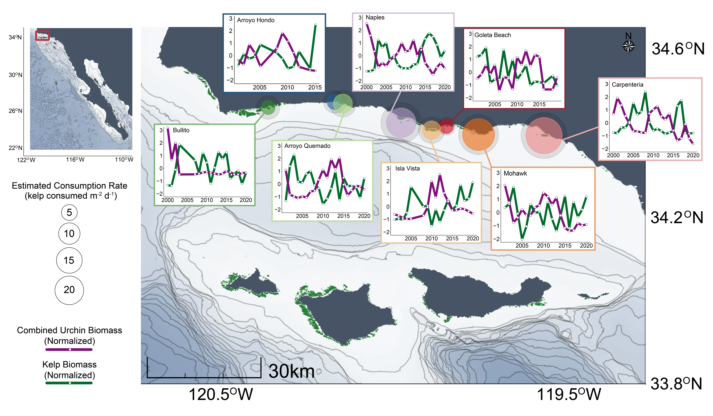
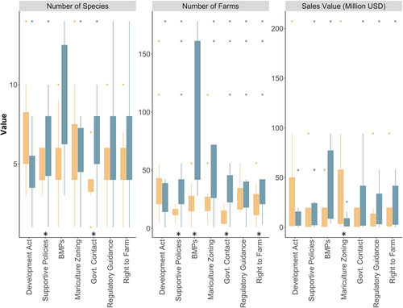
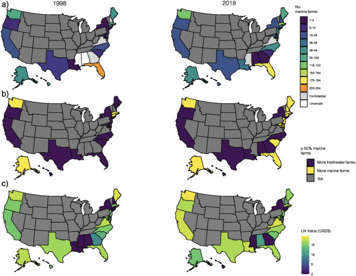
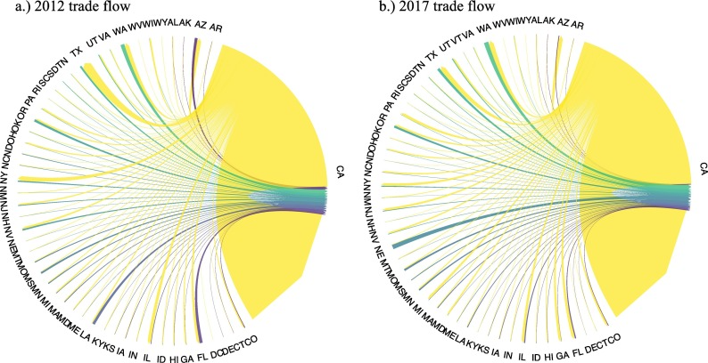

[**SB Urchin Herbivory Project**](https://github.com/maerennick/urchin_ranching)

{width="100%"}

[**Diverse state-level marine aquaculture policy in the United States. Opportunities and barriers for industry development**](https://doi.org/10.1111/raq.12631)

{width="71%"}

[**Piecing together the data of the U.S. marine aquaculture puzzle**](https://doi.org/10.1016/j.jenvman.2022.114623)

{width="83%"}

[**California aquaculture in the changing food seascape**](https://doi.org/10.1016/j.aquaculture.2022.738009)

{width="100%"}
